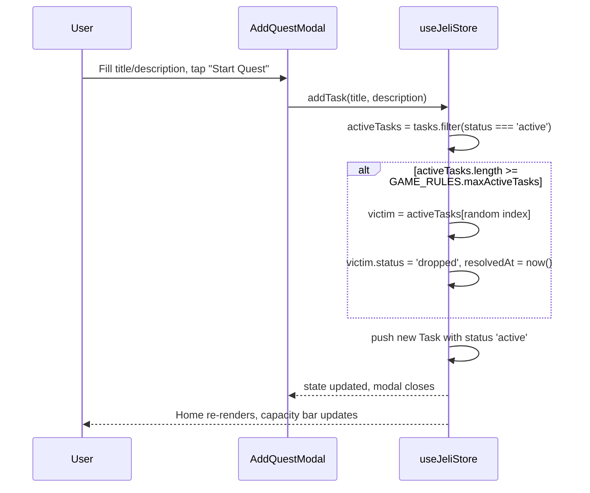
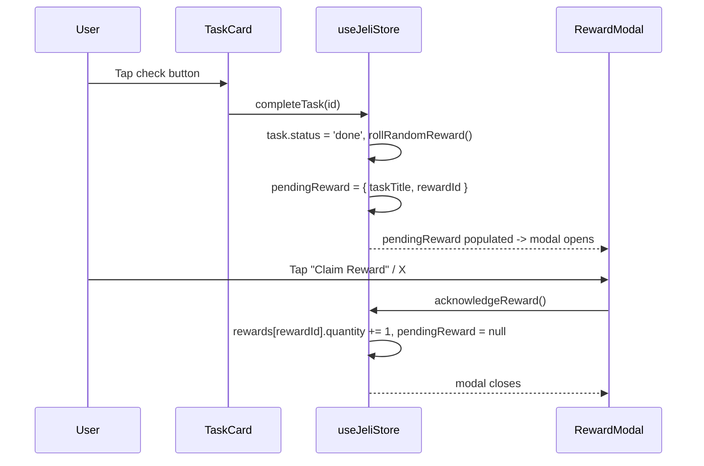

# Jeli — System Architecture Blueprint

## 1. High-Level Architecture

```mermaid
flowchart TB
    subgraph Config["Configuration (src/config/)"]
        AppConfig["app.config.ts<br/>identity, rules, defaults, copy"]
        ThemeConfig["theme.config.ts<br/>colors, shadows, fonts"]
    end

    subgraph Client["Client App (React 18 + Vite + TypeScript)"]
        UI["UI Components<br/>Home / Gallery / Log / Config"]
        Store["Zustand Store<br/>useJeliStore.ts"]
        Audio["Audio Manager<br/>(Web Audio synth SFX + HTMLAudioElement ambient loop)"]
        Persist["zustand/persist<br/>storage.ts adapter"]
        UI -->|reads/dispatches| Store
        Store -->|writes on change, async| Persist
        Persist -->|hydrates on load, async| Store
        UI -->|play(sfxKey)| Audio
    end

    subgraph Native["Capacitor Shell (Android - Air-Gapped Sandbox)"]
        Prefs[("Preferences plugin<br/>-> Android SharedPreferences<br/>private MODE_PRIVATE storage")]
        WebView["Android WebView<br/>https scheme & cleartext blocked"]
        Gradle["Gradle Release Build<br/>(R8 minification & resource shrinking)"]
    end

    AppConfig -->|game rules, defaults, copy| UI
    AppConfig -->|game rules, defaults| Store
    AppConfig -->|ambient source, volume bounds| Audio
    ThemeConfig -->|design tokens| TailwindCfg["tailwind.config.ts"]
    TailwindCfg -->|generated utility classes| UI
    AppConfig -->|appId / appName| CapConfig["capacitor.config.ts"]
    ThemeConfig -->|splash background| CapConfig
    CapConfig --> Native

    Client -- "npx cap sync" --> Native
    Native -- "renders dist/ bundle" --> WebView
    Persist -->|"@capacitor/preferences bridge"| Prefs
```

There is no backend, no network call, and no cloud sync anywhere in this
diagram — that's deliberate. Jeli is a fully offline app: every box above
either runs on-device (the WebView/JS layer) or is on-device native
storage (`Prefs`). The app has no concept of a signed-in user or a server
to be unreachable from.

## 2. State Management Strategy

Jeli is **fully offline, on-device only**: every interaction (add / edit /
complete / drop a quest, claim a reward, change settings) writes
synchronously to the Zustand store, which is the single source of truth
for the UI, and is then persisted to native on-device storage. There is
no server, no account, and nothing that requires a network connection —
the app works identically with the radio off.

- **Store**: `src/store/useJeliStore.ts` — one flat Zustand store holding
  `tasks`, `rewards`, `profile`, `audio`, the transient `pendingReward`,
  and a `hasHydrated` flag (see below).
- **Configuration**: `src/config/app.config.ts` and
  `src/config/theme.config.ts` are the single source of truth for every
  business rule, default value, piece of copy, and design token in the
  app — see [`CONFIGURATION.md`](./CONFIGURATION.md) for the full
  reference. The store's initial state (`GAME_RULES.maxActiveTasks`,
  `DEFAULT_PROFILE`, `AUDIO_CONFIG` defaults) and persistence key
  (`STORAGE_KEYS.store`) are read from `app.config.ts` rather than
  hardcoded, so changing the active-quest cap or the starting profile is
  a one-line edit in config, not a hunt through components.
- **The on-device database**: `src/lib/storage.ts` implements zustand's
  `StateStorage` interface on top of `@capacitor/preferences`. The
  `zustand/middleware persist` wrapper uses it to serialize the store
  (minus transient UI state) under the key `STORAGE_KEYS.store`
  (`jeli-app-storage`) on every mutation, and rehydrate it on app boot.
  `@capacitor/preferences` writes through to **Android SharedPreferences**
  on-device when running as the packaged APK, and to `localStorage` when
  running in a plain browser (`npm run dev` / `npm run preview`) — same
  adapter, same code path, no environment branching. This *is* Jeli's
  database: there's no SQL, no separate schema file, and nothing to
  migrate — the shape of the data is just the shape of the `JeliState`
  TypeScript interface.
- **Async hydration**: unlike raw `localStorage`, a native Preferences
  read is asynchronous, so the store starts as its default (empty) state
  for a brief moment on cold start before the persisted data loads. The
  store's `hasHydrated` flag flips to `true` once that read resolves
  (`onRehydrateStorage` in `useJeliStore.ts`), and `App.tsx` keeps the
  intro screen up until it does — so the UI never flashes default/empty
  data before a player's real quests appear. In practice this resolves in
  single-digit milliseconds, well inside the intro's own tap-to-enter
  animation delay, so it's only ever visible on an unusually slow device.
- **Business logic lives in the store, not components.** The active-task
  cap, the random-overflow drop, and the reward roll are all pure store
  actions (`addTask`, `completeTask`) reading their limits from
  `GAME_RULES`, so they're unit-testable independent of the UI and there's
  a single, auditable place where "what happens when the cap is exceeded"
  is decided.
- **No sync, by design.** Data is scoped to the single device it was
  created on. There's no account system to build "which device is this"
  around, and adding one would cut against the "fully offline" goal — if
  cross-device sync is ever wanted later, it would need to be
  reintroduced deliberately (e.g. an opt-in backend), not assumed.

## 3. Random Overflow Mechanic — Sequence



## 4. Reward Claim Flow



## 5. Directory Structure

```
jeli-app/
├── android/                      # Native Android project shell (Capacitor)
│   ├── app/
│   │   ├── build.gradle          # R8 minification, resource shrinking, build types
│   │   ├── proguard-rules.pro    # ProGuard keep rules for Capacitor bridges
│   │   └── src/main/
│   │       └── AndroidManifest.xml # Zero permissions, no-backup, cleartext blocked
├── docs/
│   ├── ARCHITECTURE.md
│   ├── CONFIGURATION.md
│   ├── CAPACITOR_BUILD_GUIDE.md
│   └── SECURITY.md               # Enterprise security baseline & OWASP MASVS mapping
├── public/
│   ├── jeli-mascot.png
│   └── audio/
│       └── ambient.mp3          # looping bed only — SFX are synthesized, no files
├── src/
│   ├── main.tsx
│   ├── App.tsx
│   ├── global.css
│   ├── vite-env.d.ts
│   ├── config/
│   │   ├── index.ts
│   │   ├── app.config.ts
│   │   └── theme.config.ts
│   ├── types/
│   │   └── index.ts
│   ├── store/
│   │   └── useJeliStore.ts
│   ├── lib/
│   │   ├── audioManager.ts
│   │   ├── interactionSynth.ts  # Web Audio-synthesized SFX (click/add/drop/complete/reward)
│   │   ├── rewards.ts
│   │   └── storage.ts           # Capacitor Preferences adapter — the on-device database
│   └── components/
│       ├── layout/
│       │   ├── BottomNav.tsx
│       │   └── ScreenHeader.tsx
│       ├── home/
│       │   ├── HomeScreen.tsx
│       │   ├── TaskCard.tsx
│       │   └── QuestCapacityBar.tsx
│       ├── quest/
│       │   ├── AddQuestModal.tsx
│       │   └── EditQuestModal.tsx
│       ├── reward/
│       │   └── RewardModal.tsx
│       ├── gallery/
│       │   ├── GalleryScreen.tsx
│       │   ├── GalleryCard.tsx
│       │   └── RewardDetailModal.tsx
│       ├── log/
│       │   ├── LogScreen.tsx
│       │   └── LogItem.tsx
│       ├── intro/
│       │   └── IntroScreen.tsx
│       ├── system/
│       │   └── ErrorBoundary.tsx
│       └── settings/
│           └── SettingsScreen.tsx
├── index.html
├── package.json
├── vite.config.ts
├── tailwind.config.ts             # imports theme tokens from src/config/theme.config.ts
├── postcss.config.js
├── tsconfig.json
└── capacitor.config.ts            # imports identity/theme from src/config/
```

## 6. Design Token Summary

Canonical source: [`src/config/theme.config.ts`](../src/config/theme.config.ts)
(`THEME_COLORS`) — `tailwind.config.ts` imports it directly, so this table
reflects generated Tailwind classes rather than a value maintained twice.

| Token | Hex | Usage |
|---|---|---|
| Primary Cyan | `#00C7FF` | Primary buttons, capacity bar fill |
| Deep Cyan | `#0CB4E3` | Borders, pixel-button shadows |
| Soft Light Blue | `#9ECFF9` | Track backgrounds, locked states |
| Background Ice White | `#DBF7FF` | App canvas background |
| Vibrant Accent Cyan | `#5CDBFF` | Edit button fill, hover states |
| Light Highlight Cyan | `#7CE2FF` | Top bevel on 3D pixel buttons |
| Purple (FAB) | `#8B5CF6` | Central Add Quest button |
| Emerald | `#10B981` | Done log, complete actions |
| Gold | `#F5B700` | Rewards, crown, epic rarity |
| Ruby | `#EF4444` | Dropped log, destructive actions |

Fonts: `Press Start 2P` for pixel display headings/labels, `Silkscreen` for
body copy — both loaded via Google Fonts in `index.html`, using the URL
also mirrored at `THEME_FONT_STYLESHEET_URL` in `theme.config.ts`.

See [`CONFIGURATION.md`](./CONFIGURATION.md) for the complete list of
configurable business rules, defaults, and copy alongside these tokens.

## 7. Enterprise Security & Platform Isolation

Jeli enforces enterprise-grade local isolation and platform hardening:

* **Zero Permissions Boundary:** The native Android manifest declares no runtime permissions (`android.permission.INTERNET` is completely omitted). The Linux kernel enforces this physical air-gap at the OS level.
* **Network & Cleartext Block:** `android:usesCleartextTraffic="false"` and modern `https` scheme isolation (`androidScheme: "https"` in `capacitor.config.ts`).
* **Anti-Data-Leakage Backup Policy:** `android:allowBackup="false"` and `android:fullBackupContent="false"` prevent silent local state exports to third-party cloud accounts (e.g. Google Drive).
* **On-Device Sandboxed Storage:** Persisted data writes strictly to private internal storage (`/data/data/com.jeli.questjournal/shared_prefs/CapacitorStorage.xml`) with `Activity.MODE_PRIVATE` (`0600` POSIX UID isolation).
* **Binary Hardening (R8 / ProGuard):** Release builds execute bytecode optimization, minification (`minifyEnabled true`), and resource shrinking (`shrinkResources true`) while preserving Capacitor reflection bridges through custom keep rules in `proguard-rules.pro`.
* **Frontend Injection Immunity:** User input renders exclusively via React standard text expressions without `dangerouslySetInnerHTML`.

For detailed threat modeling, STRIDE analysis, and OWASP MASVS controls mapping, refer to [`docs/SECURITY.md`](./SECURITY.md).

