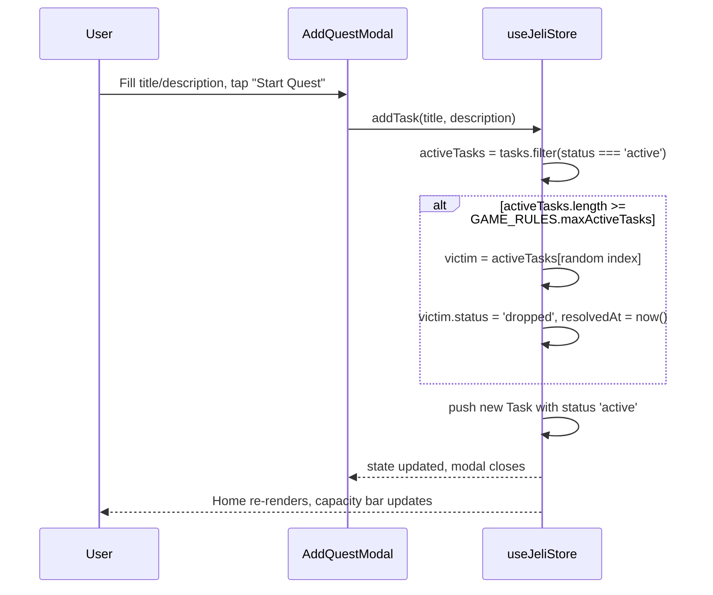
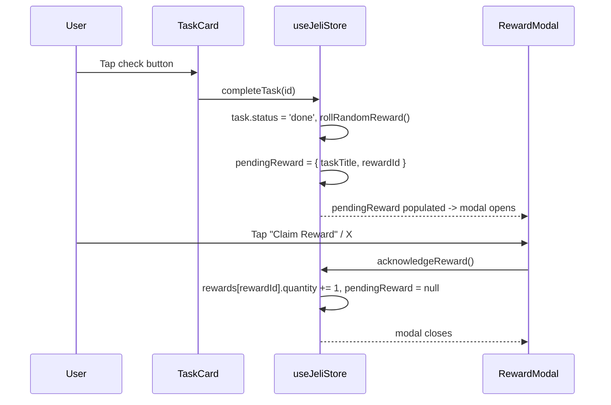

# Jeli — System Architecture Blueprint

## 1. High-Level Architecture

```mermaid
flowchart TB
    subgraph Config["Configuration (src/config/)"]
        AppConfig["app.config.ts<br/>identity, rules, defaults, copy"]
        ThemeConfig["theme.config.ts<br/>colors, shadows, fonts"]
    end

    subgraph Client["Client App (React 18 + Vite + TypeScript)"]
        UI["UI Components<br/>Home / Gallery / Log / Config"]
        Store["Zustand Store<br/>useJeliStore.ts"]
        Audio["Audio Manager<br/>(Web Audio synth SFX + HTMLAudioElement ambient loop)"]
        Persist["zustand/persist<br/>localStorage adapter"]
        UI -->|reads/dispatches| Store
        Store -->|writes on change| Persist
        Persist -->|hydrates on load| Store
        UI -->|play(sfxKey)| Audio
    end

    subgraph Native["Capacitor Shell (Android)"]
        WebView["Android WebView"]
        Gradle["Gradle Build<br/>(APK / AAB output)"]
    end

    subgraph Backend["Supabase Backend (optional cloud sync)"]
        Auth["Supabase Auth"]
        DB[("PostgreSQL<br/>users / tasks / rewards / user_rewards")]
        RLS["Row Level Security Policies"]
    end

    AppConfig -->|game rules, defaults, copy| UI
    AppConfig -->|game rules, defaults| Store
    AppConfig -->|ambient source, volume bounds| Audio
    ThemeConfig -->|design tokens| TailwindCfg["tailwind.config.ts"]
    TailwindCfg -->|generated utility classes| UI
    AppConfig -->|appId / appName| CapConfig["capacitor.config.ts"]
    ThemeConfig -->|splash background| CapConfig
    CapConfig --> Native

    Client -- "npx cap sync" --> Native
    Native -- "renders dist/ bundle" --> WebView
    WebView -.->|optional network sync| Backend
    Store -.->|supabaseClient.ts<br/>when VITE_SUPABASE_* set| Auth
    Auth --> DB
    DB --- RLS
```

## 2. State Management Strategy

Jeli is **local-first**: every interaction (add / edit / complete / drop a
quest, claim a reward, change settings) writes synchronously to the
Zustand store, which is the single source of truth for the UI. This keeps
the app fully usable offline and gives instant, lag-free interactions —
critical for a gamified to-do app where the reward pop and drop animation
need to feel immediate.

- **Store**: `src/store/useJeliStore.ts` — one flat Zustand store holding
  `tasks`, `rewards`, `profile`, `audio`, and the transient `pendingReward`.
- **Configuration**: `src/config/app.config.ts` and
  `src/config/theme.config.ts` are the single source of truth for every
  business rule, default value, piece of copy, and design token in the
  app — see [`CONFIGURATION.md`](./CONFIGURATION.md) for the full
  reference. The store's initial state (`GAME_RULES.maxActiveTasks`,
  `DEFAULT_PROFILE`, `AUDIO_CONFIG` defaults) and persistence key
  (`STORAGE_KEYS.store`) are read from `app.config.ts` rather than
  hardcoded, so changing the active-quest cap or the starting profile is
  a one-line edit in config, not a hunt through components.
- **Persistence**: the `zustand/middleware persist` wrapper serializes the
  store (minus transient UI state) to `localStorage` under the key
  `STORAGE_KEYS.store` (`jeli-app-storage`) on every mutation, and
  rehydrates it on app boot. This satisfies the "Local-First Persistent
  State" requirement without any network dependency. Swapping the storage
  engine for IndexedDB (via a library like `idb-keyval`) is a drop-in
  change to the `persist` config's `storage` option if larger payloads
  are anticipated.
- **Optional cloud sync**: `src/lib/supabaseClient.ts` only instantiates a
  Supabase client if `VITE_SUPABASE_URL` / `VITE_SUPABASE_ANON_KEY` are
  present in the environment. When enabled, a thin sync layer (not wired
  by default) can push/pull the same shape of data to the schema in
  `supabase/schema.sql`, using `user_id = auth.uid()` for isolation.
- **Business logic lives in the store, not components.** The active-task
  cap, the random-overflow drop, and the reward roll are all pure store
  actions (`addTask`, `completeTask`) reading their limits from
  `GAME_RULES`, so they're unit-testable independent of the UI and there's
  a single, auditable place where "what happens when the cap is exceeded"
  is decided.

## 3. Random Overflow Mechanic — Sequence



## 4. Reward Claim Flow



## 5. Directory Structure

```
jeli-app/
├── android/                      # generated by `npx cap add android`
├── docs/
│   ├── ARCHITECTURE.md
│   ├── CONFIGURATION.md
│   └── CAPACITOR_BUILD_GUIDE.md
├── supabase/
│   └── schema.sql
├── public/
│   ├── jeli-mascot.png
│   └── audio/
│       └── ambient.mp3          # looping bed only — SFX are synthesized, no files
├── src/
│   ├── main.tsx
│   ├── App.tsx
│   ├── global.css
│   ├── vite-env.d.ts
│   ├── config/
│   │   ├── index.ts
│   │   ├── app.config.ts
│   │   └── theme.config.ts
│   ├── types/
│   │   └── index.ts
│   ├── store/
│   │   └── useJeliStore.ts
│   ├── lib/
│   │   ├── audioManager.ts
│   │   ├── interactionSynth.ts  # Web Audio-synthesized SFX (click/add/drop/complete/reward)
│   │   ├── rewards.ts
│   │   └── supabaseClient.ts
│   └── components/
│       ├── layout/
│       │   ├── BottomNav.tsx
│       │   └── ScreenHeader.tsx
│       ├── home/
│       │   ├── HomeScreen.tsx
│       │   ├── TaskCard.tsx
│       │   └── QuestCapacityBar.tsx
│       ├── quest/
│       │   ├── AddQuestModal.tsx
│       │   └── EditQuestModal.tsx
│       ├── reward/
│       │   └── RewardModal.tsx
│       ├── gallery/
│       │   ├── GalleryScreen.tsx
│       │   ├── GalleryCard.tsx
│       │   └── RewardDetailModal.tsx
│       ├── log/
│       │   ├── LogScreen.tsx
│       │   └── LogItem.tsx
│       ├── intro/
│       │   └── IntroScreen.tsx
│       ├── system/
│       │   └── ErrorBoundary.tsx
│       └── settings/
│           └── SettingsScreen.tsx
├── index.html
├── package.json
├── vite.config.ts
├── tailwind.config.ts             # imports theme tokens from src/config/theme.config.ts
├── postcss.config.js
├── tsconfig.json
└── capacitor.config.ts            # imports identity/theme from src/config/
```

## 6. Design Token Summary

Canonical source: [`src/config/theme.config.ts`](../src/config/theme.config.ts)
(`THEME_COLORS`) — `tailwind.config.ts` imports it directly, so this table
reflects generated Tailwind classes rather than a value maintained twice.

| Token | Hex | Usage |
|---|---|---|
| Primary Cyan | `#00C7FF` | Primary buttons, capacity bar fill |
| Deep Cyan | `#0CB4E3` | Borders, pixel-button shadows |
| Soft Light Blue | `#9ECFF9` | Track backgrounds, locked states |
| Background Ice White | `#DBF7FF` | App canvas background |
| Vibrant Accent Cyan | `#5CDBFF` | Edit button fill, hover states |
| Light Highlight Cyan | `#7CE2FF` | Top bevel on 3D pixel buttons |
| Purple (FAB) | `#8B5CF6` | Central Add Quest button |
| Emerald | `#10B981` | Done log, complete actions |
| Gold | `#F5B700` | Rewards, crown, epic rarity |
| Ruby | `#EF4444` | Dropped log, destructive actions |

Fonts: `Press Start 2P` for pixel display headings/labels, `Silkscreen` for
body copy — both loaded via Google Fonts in `index.html`, using the URL
also mirrored at `THEME_FONT_STYLESHEET_URL` in `theme.config.ts`.

See [`CONFIGURATION.md`](./CONFIGURATION.md) for the complete list of
configurable business rules, defaults, and copy alongside these tokens.
