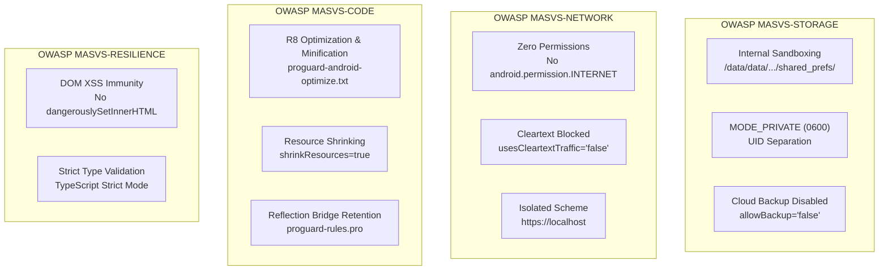

# Jeli — Enterprise Security Architecture & Platform Controls

This document establishes the security baseline, threat model, and platform security controls implemented for **Jeli (Quest Journal)**. It aligns with the **OWASP Mobile Application Security Verification Standard (MASVS v2.0)** and specifies the exact native Android and frontend guardrails that govern the application.

---

## 1. Executive Summary & Security Philosophy

Jeli is architected under the principle of **Zero-Trust Local Isolation**:
* **100% Offline by Design:** The application executes entirely on-device with **zero external backend, zero cloud synchronizations, and zero network calls**.
* **Zero Runtime Permissions:** The app declares no dangerous or normal runtime permissions (`android.permission.INTERNET`, `READ_EXTERNAL_STORAGE`, `CAMERA`, etc. are strictly omitted). The Linux kernel enforces this hardware and network air-gap at the operating system level.
* **No Telemetry or Third-Party Analytics:** No advertising SDKs, tracking pixels, or remote crash reporters exist in the dependency tree.
* **Minimal Attack Surface:** Because no sensitive authentication credentials, financial records, or Personally Identifiable Information (PII) are ingested or stored, security focuses on **host device sandboxing, code/binary integrity, and local injection immunity**.

---

## 2. Threat Modeling & Risk Assessment

| Threat Vector | Severity for Jeli | Threat Description | Implemented Countermeasure |
|---|---|---|---|
| **Data Exfiltration / Sniffing** | None / Prevented | Attacker intercepts data in transit or malicious dependency leaks quest data. | **Zero Permissions & Cleartext Block:** `INTERNET` permission removed from `AndroidManifest.xml`; `android:usesCleartextTraffic="false"` explicitly enforced. |
| **Cloud Backup Data Leakage** | Low / Mitigated | Device backup automatically uploads unencrypted local app data to third-party cloud (Google Drive). | **Backup Disabled:** `android:allowBackup="false"` and `android:fullBackupContent="false"` set in `AndroidManifest.xml`. |
| **Cross-App Sandbox Breaches** | Low / Mitigated | Malicious application on the same device attempts to inspect or tamper with Jeli state. | **Linux UID Isolation & Private Storage:** `@capacitor/preferences` writes to private internal storage (`/data/data/com.jeli.questjournal/shared_prefs/`) using `Context.MODE_PRIVATE` (permissions `0600`). |
| **DOM-based Cross-Site Scripting (XSS)** | Low / Mitigated | Malicious payload entered into quest title or description executes arbitrary JavaScript in the WebView. | **Native React JSX Escaping:** All user-supplied inputs render via standard text nodes (`{task.title}`), with zero usage of `dangerouslySetInnerHTML`. |
| **WebView Scheme Tampering** | Low / Mitigated | Local file inclusion or cross-origin leakage through the `file://` protocol. | **Isolated Scheme:** Enforced `androidScheme: "https"` in `capacitor.config.ts`, ensuring secure context isolation. |
| **Reverse Engineering & Dead Code** | Low / Mitigated | Unoptimized bytecode exposes unused native APIs or bloated library attack surface. | **R8 / ProGuard Release Pipeline:** `minifyEnabled true` and `shrinkResources true` enabled with targeted keep rules for Capacitor reflection bridges. |

---

## 3. OWASP MASVS Controls Mapping

Jeli conforms to the following controls from the **OWASP Mobile Application Security Verification Standard (MASVS)**:



### Detailed Control Specifications

### 3.1. MASVS-STORAGE: Local Storage Sandboxing
* **Target Directory:** `/data/data/com.jeli.questjournal/shared_prefs/CapacitorStorage.xml`
* **Access Mode:** `Activity.MODE_PRIVATE` (mode `0x0000`).
* **Enforcement:** Enforced in native layer via `Preferences.java` (`context.getSharedPreferences(configuration.group, Activity.MODE_PRIVATE)`). No shared or world-accessible flags (`MODE_WORLD_READABLE`, `MODE_WORLD_WRITEABLE`) are permitted.
* **Backup Policy:**
  ```xml
  <!-- android/app/src/main/AndroidManifest.xml -->
  <application
      android:allowBackup="false"
      android:fullBackupContent="false"
      ... >
  ```
  Prevents the Android Backup Service (`bmgr`) from archiving local preferences to external cloud accounts.

### 3.2. MASVS-NETWORK: Hardware & Network Air-Gap
* **Zero Permissions Guarantee:** `android/app/src/main/AndroidManifest.xml` contains **no** `<uses-permission>` elements.
* **Network Call Immunity:** Because `android.permission.INTERNET` is omitted, any attempt to instantiate a socket, HTTP request, or WebSocket is rejected immediately by the Android kernel.
* **Cleartext Protection:**
  ```xml
  <!-- android/app/src/main/AndroidManifest.xml -->
  <application
      android:usesCleartextTraffic="false"
      ... >
  ```
  Guarantees that WebViews and system components reject any unencrypted network calls.

### 3.3. MASVS-CODE: R8 / ProGuard Optimization & Bridge Integrity
* **Configuration:** `android/app/build.gradle` defines release build hardening:
  ```groovy
  buildTypes {
      release {
          minifyEnabled true
          shrinkResources true
          proguardFiles getDefaultProguardFile('proguard-android-optimize.txt'), 'proguard-rules.pro'
      }
  }
  ```
* **Bridge Integrity Rules (`android/app/proguard-rules.pro`):**
  R8 operates with `proguard-android-optimize.txt` for maximum dead-code elimination, while preserving reflection-driven Capacitor native plugins:
  ```proguard
  # Preserve Capacitor reflection bridges and plugin annotations
  -keep public class com.getcapacitor.** { *; }
  -keep public class * extends com.getcapacitor.Plugin { *; }
  -keep public class * extends com.getcapacitor.Bridge { *; }
  -keep public class * extends com.getcapacitor.BridgeActivity { *; }

  # Preserve JavascriptInterface for WebView IPC
  -keepattributes JavascriptInterface
  -keepclassmembers class * {
      @android.webkit.JavascriptInterface <methods>;
  }

  -keepattributes *Annotation*
  -keepclassmembers class * {
      @com.getcapacitor.PluginMethod public *;
      @com.getcapacitor.annotation.CapacitorPlugin public *;
      @com.getcapacitor.annotation.Permission public *;
  }

  # Preserve Preferences plugin classes
  -keep class com.capacitorjs.plugins.** { *; }
  -keep class com.capacitorjs.plugins.preferences.** { *; }
  ```

### 3.4. MASVS-RESILIENCE: Frontend Input Sanitization
* **HTML Escaping:** Dynamic text (quest titles, descriptions, profile name) is injected solely via React text expressions:
  ```tsx
  <span className="font-pixel">{task.title}</span>
  ```
* **Audit Confirmation:** A static code scan across `src/` confirms zero occurrences of `dangerouslySetInnerHTML`, `innerHTML`, `document.write`, or `eval`.

---

## 4. Security Verification & Audit Procedures

When creating release candidates or conducting security audits, execute the following verification steps:

### 4.1. Audit Android Manifest Permissions
Verify that the compiled Android manifest contains no network or sensitive permissions:
```bash
# Dump compiled manifest permissions using Android build tools
aapt dump badging android/app/build/outputs/apk/release/app-release-unsigned.apk | grep -i permission
```
*Expected Result:* **Empty output** (no permissions declared or merged by dependencies).

### 4.2. Verify Backup Configuration
Inspect the merged manifest to ensure cloud backup remains disabled:
```bash
grep -E 'android:(allowBackup|fullBackupContent|usesCleartextTraffic)' android/app/src/main/AndroidManifest.xml
```
*Expected Result:*
```xml
android:allowBackup="false"
android:fullBackupContent="false"
android:usesCleartextTraffic="false"
```

### 4.3. Verify R8 Release Compilation & Obfuscation
Run the release build to confirm that R8 shrinks unused resources and produces valid mappings without runtime reflection breakage:
```bash
npm run build
npm run cap:sync
cd android && ./gradlew assembleRelease
```
Verify mapping outputs exist at:
`android/app/build/outputs/mapping/release/mapping.txt`

### 4.4. Verify Sandbox Storage on Connected Device
With a running device/emulator, inspect the private application sandbox:
```bash
adb shell "run-as com.jeli.questjournal ls -la /data/data/com.jeli.questjournal/shared_prefs"
```
*Expected Result:* `CapacitorStorage.xml` file permissions set to `-rw-------` (`0600`), owned by the application UID.

---

## 5. Security Maintenance Checklist

| Change Scenario | Required Security Action |
|---|---|
| **Adding a new Capacitor plugin** | 1. Check if the plugin requests Android permissions in its plugin manifest.<br/>2. If unnecessary permissions are introduced, exclude them via `<uses-permission android:name="..." tools:node="remove" />`.<br/>3. Add relevant ProGuard `-keep` rules to `android/app/proguard-rules.pro`. |
| **Updating Capacitor core** | Re-run release build verification (`./gradlew assembleRelease`) to ensure R8 optimizations continue to resolve reflection bridges properly. |
| **Modifying UI components** | Never introduce `dangerouslySetInnerHTML` or raw unescaped DOM insertions for user-controlled strings. |
